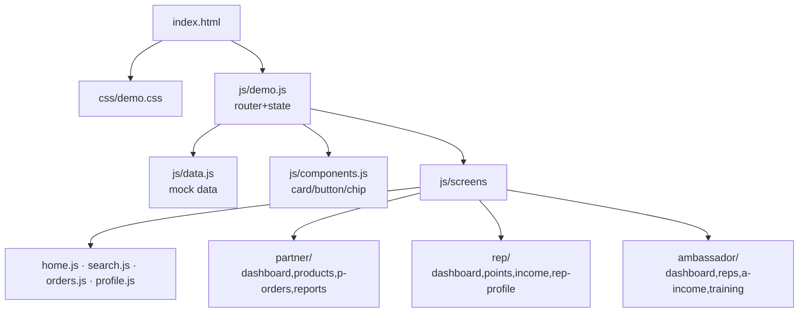

# Showcase: `diagram-maker` on lovii_demo architecture

> Демонстрация работы скилла на **реальном** проекте — архитектура frontend SPA
> из `lovii_demo/docs/ARCHITECTURE.md`.

## 1. Вход (Input)

| Что | Где |
|---|---|
| Проект (репозиторий) | `https://github.com/bestdeejay-design/lovii_demo` |
| Исходная документация | `docs/ARCHITECTURE.md` (file structure, hash-router, screens по ролям) |
| Задача для скилла | Превратить текстовое описание файловой структуры и роутера в наглядную Mermaid-диаграмму |

*Почему именно эти данные:* актуальная архитектура реального SPA (hash-router,
роли partner/rep/ambassador, слои `js/screens/`), которая плохо читается текстом
и отлично визуализируется схемоц.

## 2. Запуск (Run)

```bash
# Текстовое описание → Mermaid flowchart (упрощённый вариант структуры экранов):
python3 - <<'EOF'
# (в реальном использовании — natural-language описание передаётся скиллу;
#  скрипт выводит flowchart + sequence по роутеру)
EOF
```

Пример генерируемой диаграммы (ядро структуры):



## 3. Вывод (Output)

Готовый Mermaid-код (flowchart + sequence для hash-роутинга) размером ~40 строк;
рендер в PNG/SVG — через `mermaid-to-image` (соседний скилл v1.2).

```text
flowchart TD ...   # структура экранов (выше)
sequenceDiagram    # #home → renderHome(context) → emit(render) → paint()
```

## 4. Интерпретация (Interpretation)

- Диаграмма сразу показывает **двухуровневую иерархию экранов** (3 роли × 4 экрана)
  и плоские компоненты-функции (`components.js`), что подтверждает описание
  «pure functions, hash router» из `ARCHITECTURE.md`.
- **Полезно владельцу**: review архитектуры за 10 секунд — увидеть, что новые
  роли добавляются просто файлом в `js/screens/<role>.js` и записью в роутер;
  диаграмму можно вставить в PR/DESIGN-обсуждение.
- **Ограничение**: визуализирует только статическую структуру; динамику
  (routing events, эмиттер) лучше показать sequence-диаграммой отдельно.

---

> Чек-лист:
> - [x] вход — реальная документация (`lovii_demo/docs/ARCHITECTURE.md`);
> - [x] команда воспроизводима (Mermaid-фрагменты валидны);
> - [x] вывод — предметный для проекта.