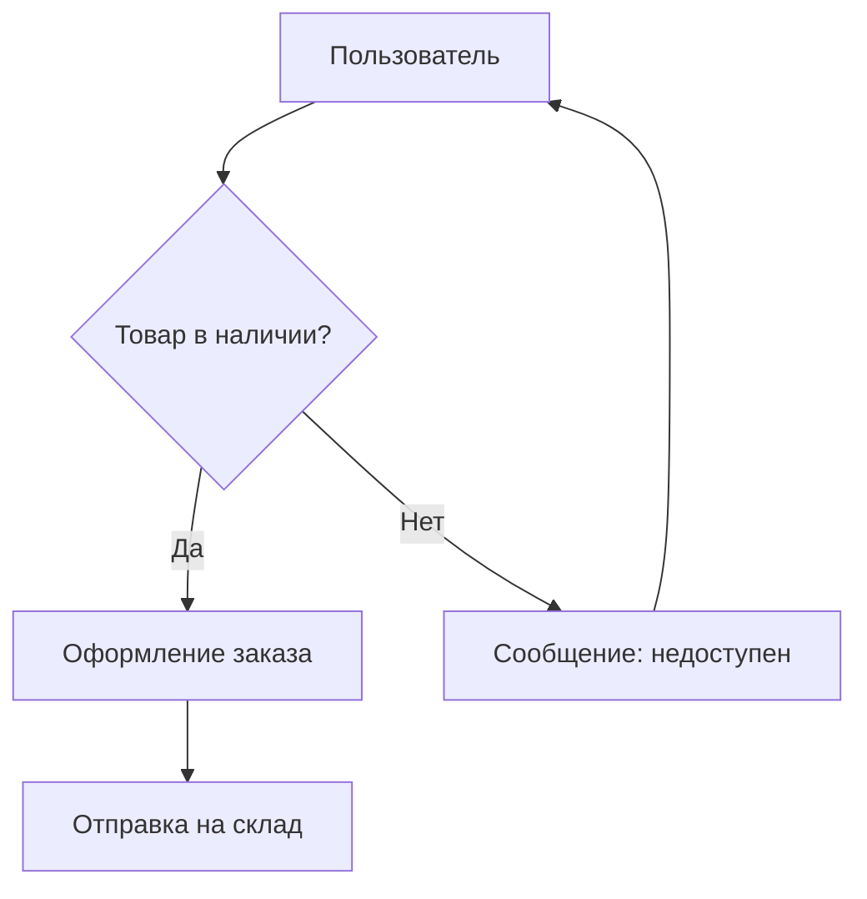
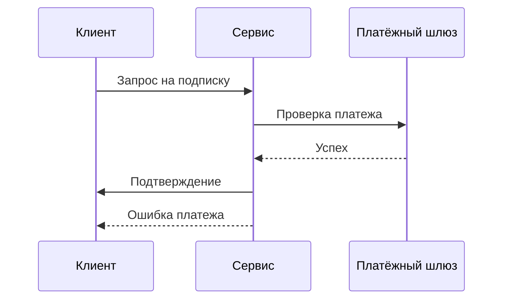
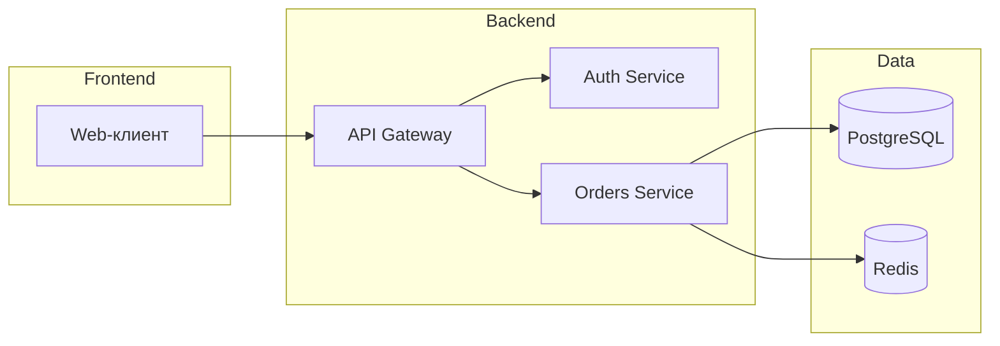
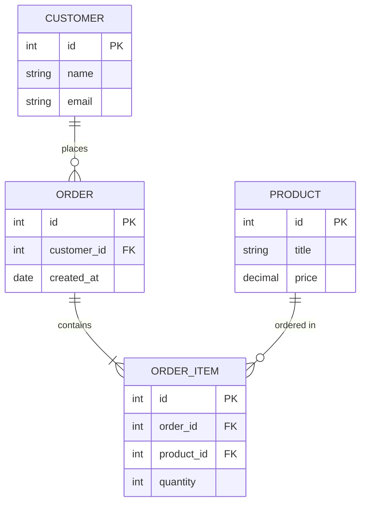

# Diagram Maker — генерация диаграмм из текстового описания

Загружай этот скилл когда нужно превратить словесное описание в диаграмму:
блок-схему процесса, sequence-диаграмму взаимодействия, схему архитектуры
сервисов или ER-схему базы данных. Выход всегда в синтаксисе Mermaid.

## When to use

- Нужна блок-схема (flowchart) бизнес-процесса или алгоритма
- Нужна sequence-диаграмма взаимодействия компонентов/пользователей
- Нужна схема архитектуры сервисов и их связей
- Нужна ER-схема (сущности и связи) для базы данных
- Нужен bar/line/pie/scatter chart для визуализации данных
- Нужно быстро визуализировать описание, чтобы показать команде
- Нужен код Mermaid или интерактивный HTML-график

## Do NOT use to

- Не используй для генерации изображений/картинок (это test-graphics)
- Не используй для презентаций (это presentation-maker)
- Не используй для рисования от руки или векторной графики (SVG/Canvas)
- Не используй для сложных данных с множеством серий — это `data-analysis`
- Не используй для интерактивных дашбордов с фильтрами — это `data-analysis`

## What this skill does

**Вход:** natural language описание (текст на stdin, файл или прямо в чате).

**Выход:**
1. Код Mermaid нужного типа (flowchart / sequence / architecture / er)
2. Или интерактивный HTML-график (bar / line / pie / scatter) через Chart.js
3. Рекомендация, как отрендерить результат:
   - [mermaid.live](https://mermaid.live) — быстрый онлайн-рендер
   - `mmdc` (mermaid-cli) — локальный рендер в PNG/SVG/PDF
   - MCP-сервер mermaid — рендер прямо из агента
4. (опционально) markdown-файл с mermaid-блоком через
   `scripts/mermaid_to_markdown.py`

## How to work

Шаги при генерации диаграммы:

1. **Уточни тип диаграммы.** Если пользователь не назвал тип — определи по
   описанию: процесс/алгоритм → flowchart; обмен сообщениями во времени →
   sequence; сервисы и связи → architecture; сущности и связи БД → er.
   Если неоднозначно — спроси или предложи наиболее вероятный тип.

2. **Составь mermaid-код.** Используй шаблоны из `templates/` как стартовую
   точку. Бери узлы и связи ТОЛЬКО из описания пользователя, не выдумывай
   лишние. Именуй узлы коротко и осмысленно.

3. **Проверь синтаксис.** Прогони код через `scripts/mermaid_to_markdown.py`
   (валидирует кавычки и спецсимволы) или вставь в mermaid.live. Убедись,
   что все связи замкнуты (каждый упомянутый узел соединён хотя бы одной
   стрелкой) и нет «висячих» узлов.

4. **Отрендерь.** Предложи пользователю mermaid.live, mermaid-cli (`mmdc`)
   или MCP-рендер. Если нужен файл — сформируй markdown с mermaid-блоком.

### Быстрый запуск скрипта

```bash
# Из файла с описанием
python3 scripts/mermaid_to_markdown.py --type flowchart input.txt --output out.md

# Из stdin
echo "A -> B -> C" | python3 scripts/mermaid_to_markdown.py --type flowchart

# С заголовком секции
python3 scripts/mermaid_to_markdown.py --type er --title "Схема БД" schema.txt

# Bar chart из CSV
python3 scripts/mermaid_to_markdown.py --type bar --input data.csv --output chart.html
```

## Data visualization examples

### 1. Bar chart — сравнение категорий

```html
<canvas id="chart1"></canvas>
<script src="https://cdn.jsdelivr.net/npm/chart.js@4.4.0/dist/chart.umd.min.js"></script>
<script>
new Chart(document.getElementById('chart1'), {
  type: 'bar',
  data: {
    labels: ['Free', 'Starter', 'Pro', 'Enterprise'],
    datasets: [{ data: [12, 28, 45, 72], backgroundColor: '#1C1C1A', borderRadius: 4 }]
  },
  options: { responsive: true, plugins: { legend: { display: false } } }
});
</script>
```

### 2. Line chart — временной ряд

```html
<canvas id="chart2"></canvas>
<script>
new Chart(document.getElementById('chart2'), {
  type: 'line',
  data: {
    labels: ['Пн', 'Вт', 'Ср', 'Чт', 'Пт'],
    datasets: [{ data: [10, 25, 18, 32, 28], borderColor: '#1C1C1A', fill: false }]
  },
  options: { responsive: true }
});
</script>
```

### 3. Pie chart — структура данных

```html
<canvas id="chart3"></canvas>
<script>
new Chart(document.getElementById('chart3'), {
  type: 'pie',
  data: {
    labels: ['Organic', 'Direct', 'Referral', 'Social'],
    datasets: [{ data: [40, 25, 20, 15] }]
  },
  options: { responsive: true }
});
</script>
```

## Mermaid examples

### 4. Flowchart — блок-схема оформления заказа

Описание: «Пользователь добавляет товар в корзину. Если товар в наличии —
переходим к оформлению, иначе показываем сообщение о недоступности. После
оформления отправляем заказ на склад.»



### 5. Sequence — оформление подписки

Описание: «Клиент отправляет запрос на подписку. Сервис проверяет платёж,
списывает средства и возвращает подтверждение. При ошибке платежа клиент
получает сообщение об ошибке.»



### 6. Architecture — микросервисы



### 7. ER — схема базы данных



## Constraints & gotchas

- **Синтаксис Mermaid строгий.** Одна лишняя скобка или кавычка ломает
  рендер. Всегда проверяй код перед выдачей.
- **Не выдумывай узлы.** Включай только те сущности и связи, которые есть в
  описании пользователя. Если чего-то не хватает — уточни.
- **Проверь, что связи замкнуты.** Каждый узел должен быть соединён хотя бы
  одной стрелкой. «Висячие» узлы — признак неполного описания.
- **Кавычки в label.** Если текст узла содержит спецсимволы (`[`, `]`, `{`,
  `}`, `(`, `)`, `:`, `#`) — оборачивай label в одинарные или двойные
  кавычки: `A["Текст: с двоеточием"]`.
- **Не используй эмодзи и не-ASCII спецсимволы** в label без необходимости —
  они могут сломать рендер в старых версиях mermaid.
- **Большие диаграммы.** Если узлов больше 20 — разбей на подграфы
  (`subgraph`) или на несколько диаграмм. Скрипт предупредит об этом.
- **ER-схема:** связи задаются через `||--o{`, `}o--||` и т.п. — не путай
  с flowchart-стрелками.
- **Sequence:** участники объявляются через `participant`, сообщения — через
  `->>` (запрос) и `-->>` (ответ).

## Reference

- Официальная документация Mermaid: https://mermaid.js.org
- Онлайн-редактор: https://mermaid.live
- mermaid-cli (локальный рендер): https://github.com/mermaid-js/mermaid-cli
- Синтаксис flowchart: https://mermaid.js.org/syntax/flowchart.html
- Синтаксис sequence: https://mermaid.js.org/syntax/sequenceDiagram.html
- Синтаксис ER: https://mermaid.js.org/syntax/entityRelationshipDiagram.html